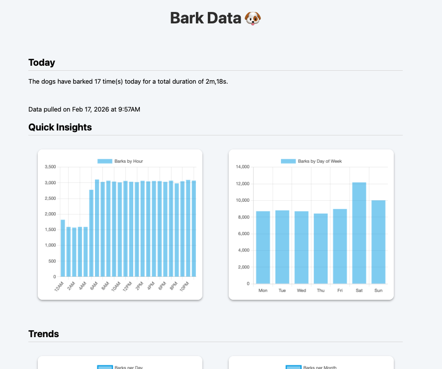

# Dog Bark Detection & Analytics

Real-time dog bark detection using a TensorFlow Lite model (YAMNet), plus tools to simulate bark data and visualize trends in a web dashboard.

This project consists of three main components:

1. **Bark Detector** – records audio and detects dog barks using ML  
2. **Data Simulator** – generates realistic synthetic bark logs  
3. **Dashboard** – Flask-based analytics dashboard for exploring bark data  

---

# Overview

The bark detector continuously listens to microphone input, classifies audio using a pretrained YAMNet model, and logs bark events to a CSV file.

Each bark session is recorded with:

- Timestamp  
- Sound classification  
- Duration  

These logs can be analyzed directly or visualized using the included dashboard.

---

## Features

### Bark Detector

- Real-time audio capture  
- TensorFlow Lite inference (YAMNet)  
- Dog-bark-focused label filtering  
- Session tracking (start/end/duration)  
- CSV logging  

---

### Data Simulator

- Generates synthetic bark logs for testing  
- Configurable number of days  
- Time-of-day weighting  
- Seasonal effects  
- Random “good” and “bad” days  
- Chronologically ordered events  

Useful for testing analytics without weeks of real recordings.

---

### Dashboard

Flask-based dashboard with Chart.js visualizations.

Example metrics:

- Barks per hour of day  
- Barks per weekday  
- Barks per day (trend)  
- Barks per month  
- Average session duration  
- Longest barking sessions  
- “Today” summary stats  

---

## Setup

### Python

Python 3.11 is recommended. Later versions have compatibility issues with TensorFlow.

Install dependencies:
`pip install -r requirements.txt`

### Model Files (Required)

This project uses YAMNet in TensorFlow Lite format. These are not included due to size and licensing.

You must download:

- `1.tflite`
- `yamnet_class_map.csv`

Place them in the project's root directory.

`1.tflite` can be found here: https://www.kaggle.com/models/google/yamnet/tfLite
Scroll down to "Model Variations", select "LiteRT (formerly TFLite)" and "classification-tflite" as the variation. Scroll down to "File Explorer" and click the download icon. File should be approximately 4.13 MB.

`yamnet_class_map.csv` can be found at TensorFlow's GitHub repository here: https://github.com/tensorflow/models/blob/master/research/audioset/yamnet/yamnet_class_map.csv

---

## Usage

### 1) Bark Detector

`python bark_detector.py`

Continually listens and logs bark events. Press `CTRL+C` to quit.

### 2) Bark Simulator

`python bark_simulator.py`

Generates a log file of randomized bark events. Number of days worth of data can be adjusted in the script.

### 3) Bark Dashboard

`python bark_dashboard.py`

Once running, use a web browser to navigate to `http://127.0.0.1:5000`. Script includes an easily togglable flag to switch between log files generated by the detection software or the simulation software for testing purposes.

---

## Notes

- Designed for local use and experimentation
- Flask dev server is not production-ready
- Microphone quality and environmental noise affect detection accuracy